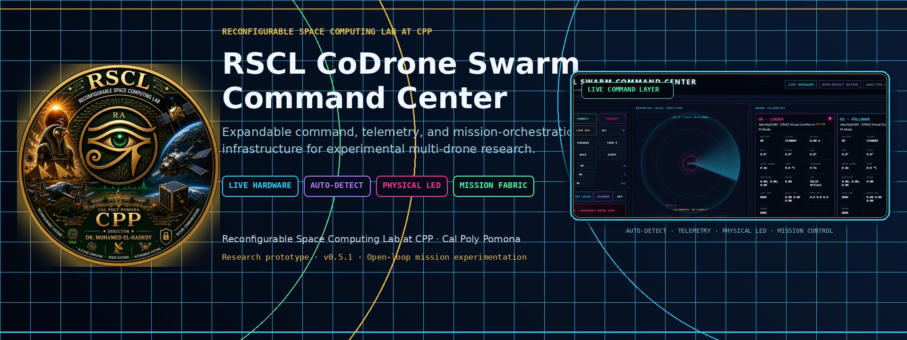
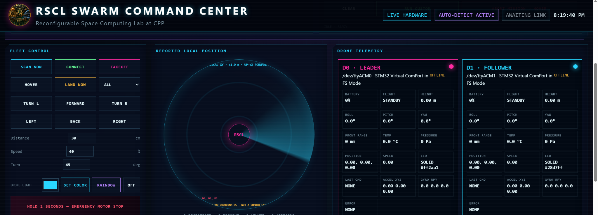
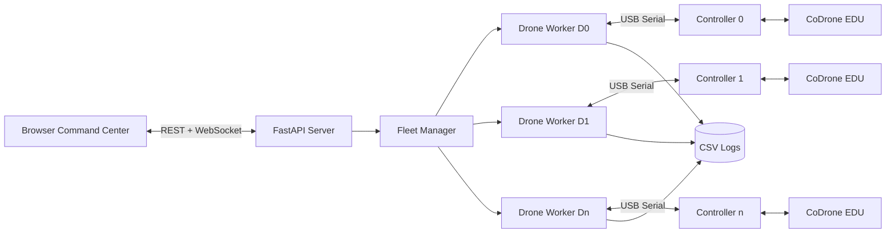
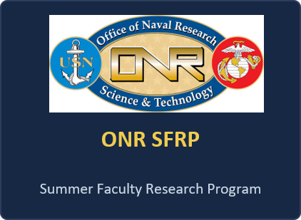
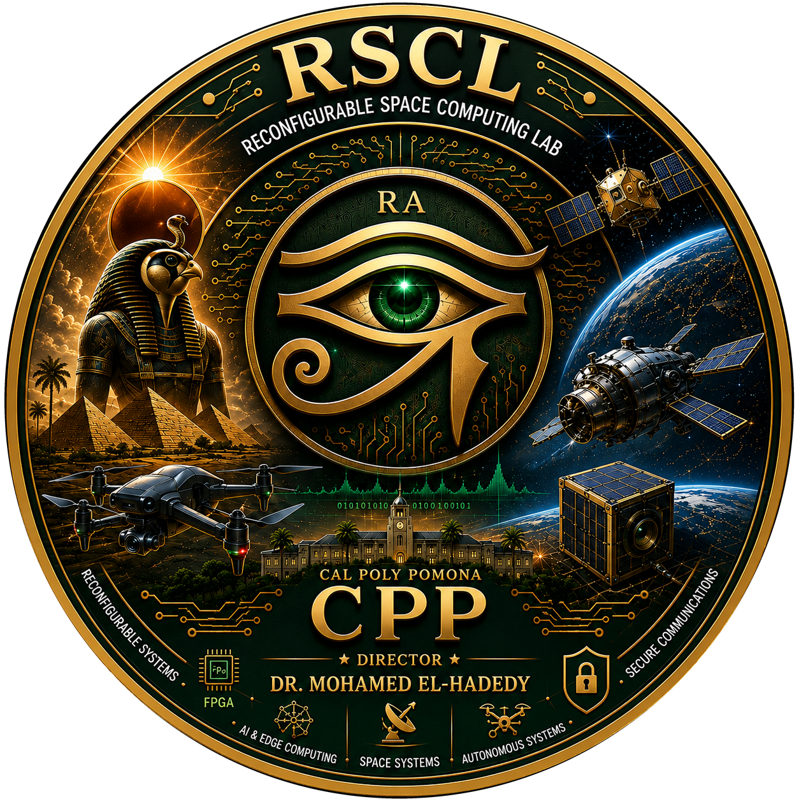

<p align="center">
  
</p>

<p align="center">
  <a href="#quick-start"></a>
  <a href="#live-hardware"></a>
  <a href="#research-status"></a>
</p>

<p align="center">
  
  
  
  
  
  
</p>

<h1 align="center">RSCL CoDrone Swarm Command Center</h1>

<p align="center">
  <strong>Expandable command, telemetry, and mission-orchestration infrastructure for experimental multi-drone research.</strong>
</p>

<p align="center">
  Reconfigurable Space Computing Lab · California State Polytechnic University, Pomona
</p>

---

## Scientific scope

The **RSCL CoDrone Swarm Command Center** is a browser-based experimental platform for operating and observing expandable fleets of CoDrone EDU vehicles. A Python/FastAPI backend manages controller discovery, per-drone command queues, telemetry acquisition, mission execution, and event logging. A browser interface provides fleet control, mission composition, local-position visualization, and physical LED commands.

The current system is intended for research in:

- distributed autonomous systems;
- multi-agent command and control;
- aerial robotics and mission orchestration;
- dependable edge execution;
- reconfigurable-computing integration.

> [!IMPORTANT]
> The current mission presets are **coordinated open-loop experiments**. They are not closed-loop collision-avoidance or formation-control algorithms.

## At a glance

<table>
<tr>
<td width="50%" valign="top">

### Fleet layer

- Automatic detection of newly attached controllers
- Dynamic registration of D0, D1, D2, and additional members
- Independent worker and command queue per drone
- Individual, subgroup, and fleet-wide targeting
- Simulation and live-hardware modes

</td>
<td width="50%" valign="top">

### Observability layer

- Battery and connection state
- Roll, pitch, yaw, acceleration, and angular velocity
- Altitude, range, pressure, temperature, and local position
- Mission-event stream and error reporting
- Per-drone CSV telemetry logging

</td>
</tr>
<tr>
<td width="50%" valign="top">

### Mission layer

- Directional and yaw operations
- Zigzag, spiral, orbit, split/merge, and wavefront patterns
- Pinwheel, dual-helix, starburst, relay, and accordion sequences
- Custom step composition
- Abort-to-hover and prioritized landing

</td>
<td width="50%" valign="top">

### Physical-light layer

- Arbitrary RGB selection
- Per-drone brightness and color assignment
- Fleet role colors
- Mission-synchronized color transitions
- Pulse, strobe, chase, and rainbow sequences

</td>
</tr>
</table>

## Command-center interface

<p align="center">
  
</p>

The interface separates fleet control, reported local position, drone telemetry, physical LED control, mission composition, and event history. Newly detected controllers are registered automatically but are **not** permitted to connect, take off, or join a mission without an explicit command.

## Architecture



Each vehicle is assigned an independent worker and serialized command queue. This architecture isolates slow serial operations and prevents one vehicle's telemetry polling or command execution from directly blocking the remaining fleet.

## Research status

| Capability | Status | Evidence |
|---|---:|---|
| Single-drone pairing and telemetry | **Validated** | Real controller and battery telemetry |
| Two-drone concurrent connection | **Validated** | Independent `/dev/ttyACM0` and `/dev/ttyACM1` workers |
| Two-drone synchronized takeoff, hover, and landing | **Validated** | Controlled live flight test |
| Three-controller automatic discovery | **Validated** | Dynamic registration of `/dev/ttyACM0..2` |
| Three-drone live telemetry connection | **Validated** | Three linked controllers with real battery values |
| Advanced mission generation | **Validated in simulation** | Multi-phase mission sequencing |
| Physical RGB mission choreography | **Implemented; live validation ongoing** | Per-drone LED command path |
| Shared-frame localization | **Not yet implemented** | Current coordinates are per-drone local frames |
| Collision-aware closed-loop formation | **Future work** | Requires shared localization and feedback control |

## Position semantics

The dashboard displays optical-flow coordinates reported independently by each drone. These values are useful for observing local motion, but they do **not** currently define a shared global swarm coordinate system.

Accordingly, the software:

- does not invent artificial marker separation;
- reports unavailable position explicitly;
- allows coincident coordinates to overlap visually;
- does not use the local-position display as a collision-avoidance measurement.

Shared-frame calibration, relative localization, and uncertainty-aware fusion are planned research directions.

## Quick start

### Prerequisites

- Python 3.10 or newer
- Windows 10/11 with WSL2 for the validated hardware workflow
- `usbipd-win` for USB passthrough
- CoDrone EDU Python library and controllers

### Install

```bash
cd ~/rscl-codrone-swarm
python3 -m venv .venv
source .venv/bin/activate
python -m pip install --upgrade pip setuptools
python -m pip install -e .
```

### Simulation

```bash
python main.py --simulate
```

Open `http://localhost:8000`.

## Live hardware

### Attach controllers from Administrator PowerShell

```powershell
usbipd list
usbipd bind --busid <BUSID>       # first use only
usbipd attach --wsl --busid <BUSID>
```

Verify inside Ubuntu:

```bash
ls -l /dev/ttyACM*
```

Start the live server:

```bash
cd ~/rscl-codrone-swarm
source .venv/bin/activate
python main.py --live
```

Wait for all intended controllers to appear, select **CONNECT**, and verify real battery values before issuing flight commands.

## Safety model

- Controlled landing is distinct from emergency motor stop.
- Landing and hover receive elevated command priority.
- Emergency motor stop requires a two-second hold.
- Hot-plugged controllers are detected but never launched automatically.
- Mission execution can be aborted to hover.
- Experimental expansion should proceed from one drone to two and then to the full fleet.

> [!CAUTION]
> Emergency motor stop removes thrust and can cause an airborne vehicle to fall. Use **LAND NOW** for normal recovery.

## Repository layout

```text
rscl-codrone-swarm/
├── assets/
│   └── rscl_logo.png
├── docs/
│   └── images/
├── logs/
│   └── .gitkeep
├── scripts/
├── src/
│   └── rscl_codrone_swarm/
│       ├── __init__.py
│       └── web_app.py
├── web/
│   ├── app.js
│   ├── index.html
│   └── styles.css
├── main.py
├── pyproject.toml
└── README.md
```

## Experimental reproducibility

For each flight experiment, record:

1. Git commit and release tag
2. Controller-to-drone assignment
3. Initial placement and heading
4. Battery levels
5. Floor texture and illumination
6. Mission parameters and target set
7. Telemetry logs
8. Deviations, aborts, and safety interventions

## Research roadmap

- Shared-frame calibration across local optical-flow coordinates
- Relative localization and inter-vehicle ranging
- Closed-loop formation control
- Collision-aware trajectory generation
- Runtime mission verification and safety constraints
- Reconfigurable edge-computing integration
- Hardware-assisted perception, security, and dependable coordination

## Citation

```bibtex
@software{elhadedy_rscl_codrone_swarm_2026,
  author       = {Mohamed El-Hadedy},
  title        = {RSCL CoDrone Swarm Command Center},
  year         = {2026},
  organization = {Reconfigurable Space Computing Lab, Cal Poly Pomona},
  url          = {https://github.com/mealycpp/rscl-codrone-swarm}
}
```

## Acknowledgments

This work is supported in part by:

<p align="center">
  
  &nbsp;&nbsp;
  
  &nbsp;&nbsp;
  
  &nbsp;&nbsp;
  
</p>

The views and conclusions in this repository are those of the authors and should not be interpreted as representing the official policies, either expressed or implied, of the sponsors or the U.S. Government.

## RSCL

<p align="center">
  
</p>

**Reconfigurable Space Computing Lab at CPP**  
California State Polytechnic University, Pomona  
Director: **Dr. Mohamed El-Hadedy**

---

<p align="center">
  <strong>Research prototype: validate every mission in simulation and controlled low-risk flight tests before fleet-scale execution.</strong>
</p>
